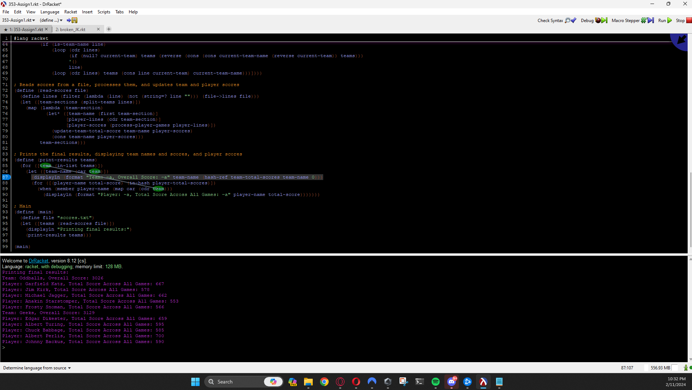

# 353-Assign1
This Racket code is designed for processing and scoring bowling games for players and teams, tracking individual and team scores based on a given input file. It calculates scores, updates total scores for players and teams, and prints the results.

## Working Copy
- Code does not split each game up, it creates a total across all game.
- Total team score is outptu

### Output from functional code ###

